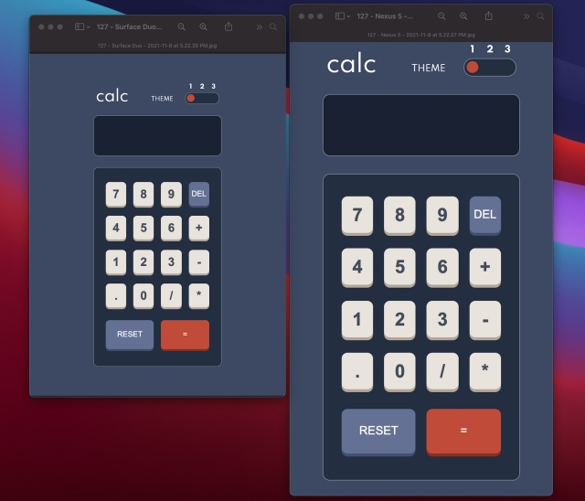
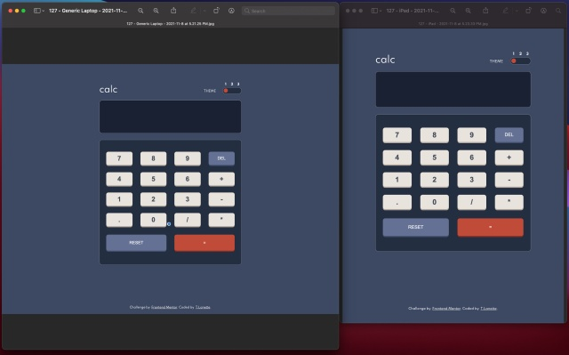

# Frontend Mentor - Calculator app solution
# Calculator-App-with-Vanilla-JS
Frontend Mentor Project: Calculator App


This is a solution to the [Calculator app challenge on Frontend Mentor](https://www.frontendmentor.io/challenges/calculator-app-9lteq5N29). Frontend Mentor challenges help you improve your coding skills by building realistic projects. 

## Table of contents

- [Overview](#overview)
  - [The challenge](#the-challenge)
  - [Screenshot](#screenshot)
  - [Links](#links)
- [My process](#my-process)
  - [Built with](#built-with)
  - [What I learned](#what-i-learned)
  - [Continued development](#continued-development)
  - [Useful resources](#useful-resources)
- [Author](#author)
- [Acknowledgments](#acknowledgments)


## Overview

### The challenge

Users should be able to:

- See the size of the elements adjust based on their device's screen size
- Perform mathmatical operations like addition, subtraction, multiplication, and division
- Adjust the color theme based on their preference
- **Bonus**: Have their initial theme preference checked using `prefers-color-scheme` and have any additional changes saved in the browser

### Screenshot





I have included two screen shots of four devices: 
* Nexus 5 (360x640)
* Surface Duo (540x720)
* iPad (768x1024)
* Laptop (1280x950)

I used an awesome open-source devtool app called [Responsively](https://opencollective.com/responsively). It allowed me to see the calculator on different sized devices live while I was editing. You can inspect the code and take screen shots.  

### Links

- Solution URL: [Here's my solution link:](https://github.com/TLanetteRose/Calculator-App-with-Vanilla-JS)
- Live Site URL: [Here's my finished site:](calculator-app-with-vanilla-js.vercel.app)

## My process

### Built with

- Semantic HTML5 markup
- CSS custom properties
- Flexbox
- CSS Grid
- Mobile-first workflow
- [Sass](https://sass-lang.com/) - CSS framework

### What I learned

I learned how to create a calculator app with a multiple theme switcher. I had made a calculator app before. However, this was the first time I had to use three color themes. The other webpage I created switched between a simple light and a dark theme. This time the color themes were more detailed. That is why I wanted to use Sass variables to handle the different colors for the elements. I am very proud of the CSS code below because it took some time for me to figure out how to set it up. I reviewed other calculator solutions to get an idea. Another code snippet that I am proud of is my JS **switch statement**. I have seen it in other code samples and read about why they are used. This was the first time that I used a switch statement in my JS code. 

My code snippets: 

```css
:root {
    /* Backgrounds */
   --color-page-bg: #{$main-bg1};
   --color-keypad-bg: #{$keypad-bg1};
   --color-toggle-bg: #{$toggle-bg1};
   --color-screen-bg: #{$screen-bg1};
   --color-screen-outline: #{$screen-outline1};
   --color-keypad-outline: #{$keypad-outline1};
   --color-toggle-outline: #{$toggle-outline1};

   /* Keys */
   --color-delete-key-bg: #{$delete-key-bg1};
   --color-delete-key-hover: #{$delete-key-hover1};
   --color-delete-shadow: #{$delete-key-shadow1};
   
   --color-reset-key-bg: #{$reset-key-bg1};
   --cover-reset-key-hover: #{$reset-key-hover1};
   --color-reset-shadow: #{$reset-key-shadow1}
   --color-equal-sign-bg: #{$equal-sign-bg1};
   --color-equal-sign-hover: #{$equal-sign-hover1};
   --color-equal-sign-shadow: #{$equal-sign-shadow1};
   --color-number-key-bg: #{$number-key-bg1};
   --color-number-key-hover: #{$number-key-hover1};
   --color-number-key-shadow: #{$number-key-shadow1};
   --color-toggle-switch-bg: #{$toggle-switch-bg1};
   --color-toggle-btn-bg: #{$toggle-btn-bg1};

   /* Text */
   --primary-text-color: #{$text-dark1};
   --secondary-text-color: #{$text-white1};
}

body.theme1 {
    /* Backgrounds */
    --color-page-bg: #{$main-bg1};
    --color-keypad-bg: #{$keypad-bg1};
    --color-toggle-bg: #{$toggle-bg1};
    --color-screen-bg: #{$screen-bg1};
    --color-screen-outline: #{$screen-outline1};
    --color-keypad-outline: #{$keypad-outline1};
    --color-toggle-outline: #{$toggle-outline1};

    /* Keys */
    --color-delete-key-bg: #{$delete-key-bg1};
    --color-delete-key-hover: #{$delete-key-hover1};
    --color-delete-shadow: #{$delete-key-shadow1};
    --color-reset-key-bg: #{$reset-key-bg1};
    --cover-reset-key-hover: #{$reset-key-hover1};
    --color-reset-shadow: #{$reset-key-shadow1}; --color-equal-sign-bg: #{$equal-sign-bg1};
    --color-equal-sign-hover: #{$equal-sign-hover1};
    --color-equal-sign-shadow: #{$equal-sign-shadow1};
    --color-number-key-bg: #{$number-key-bg1};
    --color-number-key-hover: #{$number-key-hover1};
    --color-number-key-shadow: #{$number-key-shadow1};
    --color-toggle-switch-bg: #{$toggle-switch-bg1};
    --color-toggle-btn-bg: #{$toggle-btn-bg1};

    /* Text */
    --header-text-color: #{$text-white1};
    --screen-text-color: #{$text-white1};
    --number-key-text-color: #{$text-dark1};
    --delete-reset-key-text-color: #{$text-white1};
    --footer-text-color: #{$text-white1};
    --footer-link-color: #{$text-white1};

    --primary-text-color: #{$text-dark1};
    --secondary-text-color: #{$text-white1};
    --third-text-color: #{$text-white1};
}

body.theme2 {
    /* Backgrounds */
    --color-page-bg: #{$main-bg2};
    --color-keypad-bg: #{$keypad-bg2};
    --color-toggle-bg: #{$toggle-bg2};
    --color-screen-bg: #{$screen-bg2};
    --color-screen-outline: #{$screen-outline2};
    --color-keypad-outline: #{$keypad-outline2};
    --color-toggle-outline: #{$toggle-outline2};

    /* Keys */
    --color-delete-key-bg: #{$delete-key-bg2};
    --color-delete-key-hover: #{$delete-key-hover2};
    --color-delete-shadow: #{$delete-key-shadow2};
    --color-reset-key-bg: #{$reset-key-bg2};
    --cover-reset-key-hover: #{$reset-key-hover2};
    --color-reset-shadow: #{$reset-key-shadow2}; --color-equal-sign-bg: #{$equal-sign-bg2};
    --color-equal-sign-hover: #{$equal-sign-hover2};
    --color-equal-sign-shadow: #{$equal-sign-shadow2};
    --color-number-key-bg: #{$number-key-bg2};
    --color-number-key-hover: #{$number-key-hover2};
    --color-number-key-shadow: #{$number-key-shadow2};
    --color-toggle-switch-bg: #{$toggle-switch-bg2};
    --color-toggle-btn-bg: #{$toggle-btn-bg2};

    /* Text */
    --header-text-color: #{$text-dark2};
    --screen-text-color: #{$text-dark2};
    --number-key-text-color: #{$text-dark2};
    --delete-reset-key-text-color: #{$text-white2};
    --footer-text-color: #{$text-dark2};
    --footer-link-color: #{$text-dark2};

    --primary-text-color: #{$text-dark2};
    --secondary-text-color: #{$text-white2};
    --third-text-color: #{$text-white2};
}


body.theme3 {
    /* Backgrounds */
    --color-page-bg: #{$main-bg3};
    --color-keypad-bg: #{$keypad-bg3};
    --color-toggle-bg: #{$toggle-bg3};
    --color-screen-bg: #{$screen-bg3};
    --color-screen-outline: #{$screen-outline3};
    --color-keypad-outline: #{$keypad-outline3};
    --color-toggle-outline: #{$toggle-outline3};

    /* Keys */
    --color-delete-key-bg: #{$delete-key-bg3};
    --color-delete-key-hover: #{$delete-key-hover3};
    --color-delete-shadow: #{$delete-key-shadow3};
    --color-reset-key-bg: #{$reset-key-bg3};
    --cover-reset-key-hover: #{$reset-key-hover3};
    --color-reset-shadow: #{$reset-key-shadow3}; --color-equal-sign-bg: #{$equal-sign-bg3};
    --color-equal-sign-hover: #{$equal-sign-hover3};
    --color-equal-sign-shadow: #{$equal-sign-shadow3};
    --color-number-key-bg: #{$number-key-bg3};
    --color-number-key-hover: #{$number-key-hover3};
    --color-number-key-shadow: #{$number-key-shadow3};
    --color-toggle-switch-bg: #{$toggle-switch-bg3};
    --color-toggle-btn-bg: #{$toggle-btn-bg3};

    /* Text */
    --header-text-color: #{$text-light3};
    --screen-text-color: #{$text-light3};
    --number-key-text-color: #{$text-light3};
    --delete-reset-key-text-color: #{$text-white3};
    --footer-text-color: #{$text-light3}; 
    --footer-link-color: #{$text-light3};

    --primary-text-color: #{$text-light3};
    --secondary-text-color: #{$text-white3};
    --third-text-color: #{$text-dark3};

}
```
```js
compute() {
        let computation 
        const prev = parseFloat(this.previousOperand)
        const current = parseFloat(this.currentOperand)
        if (isNaN(prev) || isNaN(current)) return
        switch (this.operation) {
            case '+':
                computation = prev + current
                break
            case '-':
                computation = prev - current
                break
            case '*':
                computation = prev * current
                break
            case '/':
                computation = prev / current
                break 
            default:
                return  
        }
        this.currentOperand = computation
        this.operation = undefined
        this.previousOperand = ''
    }
```

If you want more help with writing markdown, we'd recommend checking out [The Markdown Guide](https://www.markdownguide.org/) to learn more.

**Note: Delete this note and the content within this section and replace with your own learnings.**

### Continued development

I would love to use JavaScript to change between color themes. I have seen some code examples. However, I wanted to have a better understanding of using multiple color themes with CSS/Sass. I did try to add some personal touches to my app. I added a border to the screen, keypad, and toggle. I felt that the calculator blended too much into the surrounding page of the without a border/boundary. Finally, I want to continue to work with using JavaScript, so that I can become more confident in that language. 


### Useful resources

I used a lot of references and resources in addition to [Google](https://www.google.com/) and [StackOverflow](https://stackoverflow.com/) to build my calculator. Although this was the second calculator that I have built, I was still a little unsure about the JavaScript I would need for the calculator function. I also wanted to learn how to code the three themes using Sass variables. 

- [Freshman Tech](https://freshman.tech/calculator/) - This site helped to refresh my memory about how to build a calculator.
- [Floating Point Guide](https://floating-point-gui.de/basic/) - Freshman Tech suggested using this site to explain floating-point precision. This was helpful to understand why you get a floating number (multiple zeros after the decimal number) when you add certain decimals. 
- [CSS-Tricks Guide to Dark Mode on the Web](https://css-tricks.com/a-complete-guide-to-dark-mode-on-the-web/#toggling-themes) - Although I've built a light/dark mode website, I still needed a review on how to organize my code.
- [Create a Darklight or Custom color Theme](https://designdrastic.com/tutorial/create-a-darklight-or-custom-color-theme-using-css-and-javascript) - This site was also helpful as I researched creating custom themes. 
- [Dark Mode with Sass and CSS Variables](https://dev.to/zetareticoli/dark-mode-with-sass-and-css-variables-4f9b) - Since I was working with Sass, I needed to understand how to use variables for the three different themes. This site was very helpful. 
- [Build a Calculator with JavaScript Tutorial](https://www.youtube.com/watch?v=j59qQ7YWLxw)
[Vanilla JavaScript Calculator](https://github.com/WebDevSimplified/Vanilla-JavaScript-Calculator/blob/master/index.html) - After using the tutorial on Freshman Tech, I realized that my output (display number) didn't have commas. I researched on Google and Stack Overflow on how add commas to reflect changes in place value with my input numbers. I tried adding the suggested code to my first script file. Unfortunately, it didn't work. So, I decided to follow this tutorial. I made a new script file to use with the calculator. 
- [Stack Overflow](https://stackoverflow.com/questions/53089348/javascript-dom-calculator-display-digits-on-a-screen) - As I was following the tutorial by WebDevSimplified, I was having trouble with my screen display. This answer was helpful. 


## Author

- Website - [T.Lanette Pollard](https://www.your-site.com)
- Frontend Mentor - [@TLanetteRose](https://www.frontendmentor.io/profile/TLanetteRose)
- Twitter - [@TpLanetteNBCT](https://twitter.com/TpLanetteNBCT)

## Acknowledgments
* **Web Dev Simplified**. He created an excellent tutorial. He explained everything in detail and guided me through the process of organizing my JavaScript code. 
*  [**Carlos Morales**](https://github.com/cjosue15). I reviewed his code and got a better understanding of how to organize my Sass variables for my color themes. 


